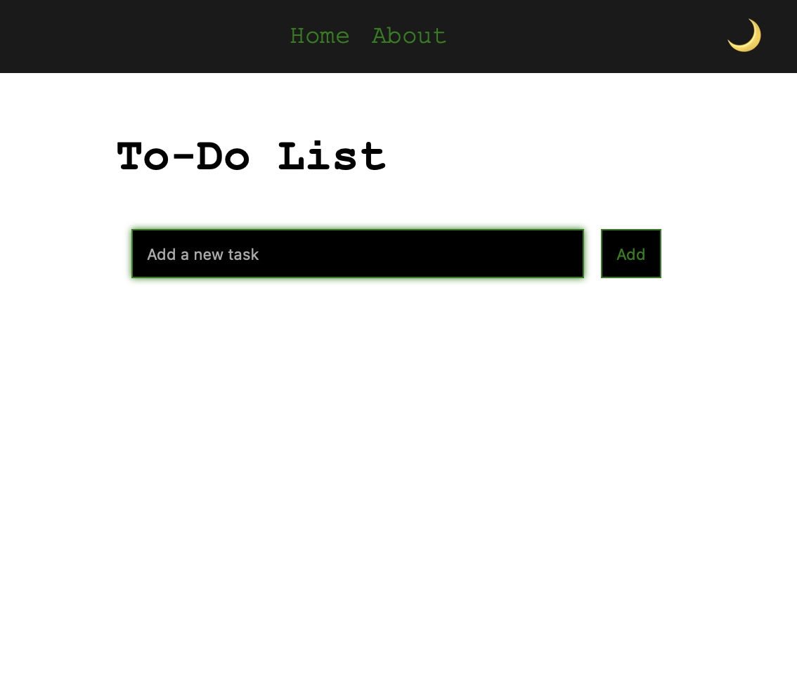

# To-Do List App

This is a simple To-Do List application built with Vue.js and TypeScript. It includes a dark mode and allows users to toggle between light and dark modes. Users can add and remove tasks from their to-do list.

## Features

- Add tasks
- Remove tasks
- Light mode by default with the option to toggle to night mode
- Responsive and modern UI theme

## Technologies Used

- Vue.js
- TypeScript
- Vuex
- Vue Router
- Vercel for deployment

## Getting Started

These instructions will help you set up the project locally.

## Prerequisites

- Node.js
- npm or yarn

## Installation

1. Clone the repository:

   ```bash
   git clone https://github.com/GuesswhoLW/todo-app.git
   cd todo-app

2. Install dependencies:

    ```bash
    npm install

## Running the App

To run the app locally, use the following command:

  ```bash
  npm run serve
  ```

Open your browser and go to http://localhost:8080 to see the application.

## Building for Production

To build the app for production, use the following command:

  ```bash
  npm run build
  ```
## Deployment

This app is deployed on Vercel. To deploy your own version, you can follow these steps:

1. Install Vercel CLI:

    ```bash
    npm install -g vercel

2. Login to Vercel:

    ```bash
    vercel login

3. Deploy the app:

    ```bash
    vercel

## Folder Structure

	•	src/: Contains the source code
        •	assets/: Contains static assets like styles
        •	components/: Contains Vue components
        •	views/: Contains view components
        •	store/: Contains Vuex store
        •	router/: Contains Vue Router configuration
	•	public/: Contains the public assets like index.html

## Screenshots




## Contributing

Contributions are welcome! Please feel free to submit a Pull Request.

## License

This project is licensed under the MIT License. See the LICENSE file for more details.

## Contact

[](https://twitter.com/guesswholw)
[](https://discordapp.com/users/guesswholw)
[](https://t.me/guesswholw)
